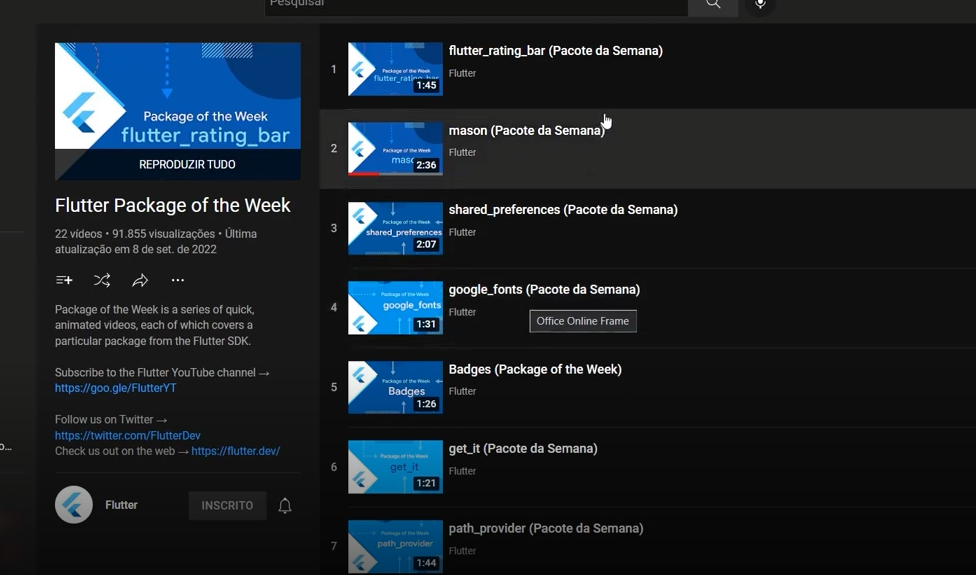

## Gerando os icones trocando o nome do app

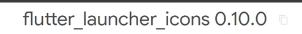

https://pub.dev/packages/flutter_launcher_icons

## instalando o font awesome

https://pub.dev/packages/font_awesome_flutter

## Indicador de porcentagens

https://pub.dev/packages/percent_indicator

## Auto Size Text
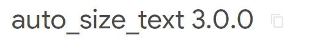
https://pub.dev/packages/auto_size_text

## Animated Text Kit

https://pub.dev/packages/animated_text_kit
flutter pub add animated_text_kit
animated_text_kit: ^4.2.2

## Bottom naviation convex
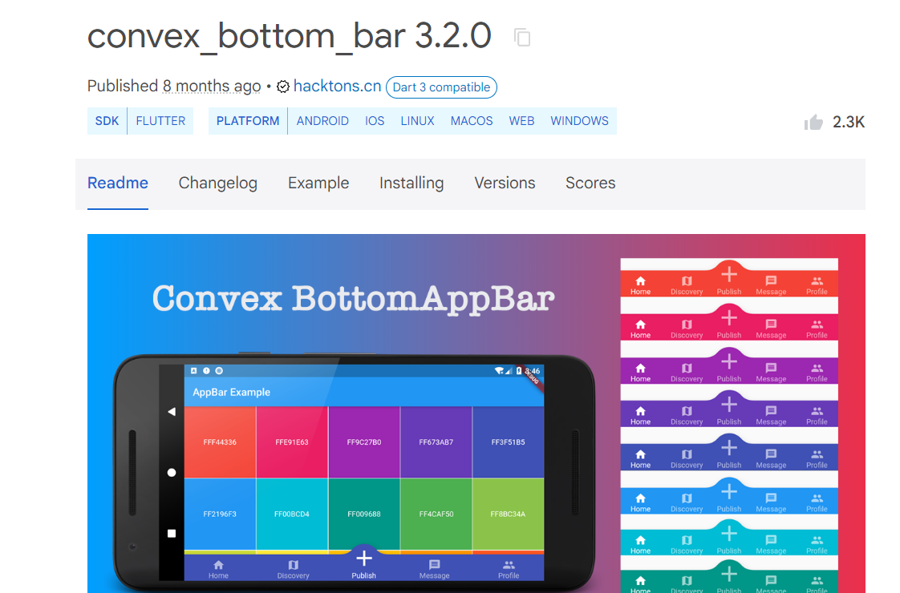
convex_bottom_bar: ^3.2.0
flutter pub add convex_bottom_bar

## Padroes brasileiro 
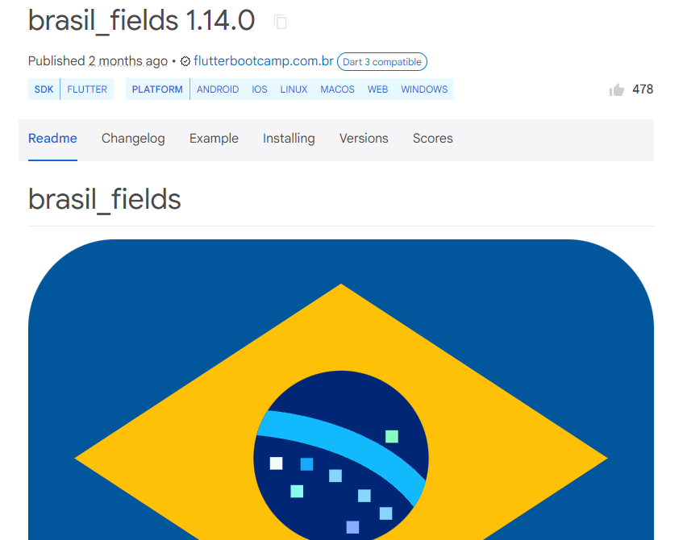
brasil_fields: ^1.14.0
flutter pub add brasil_fields

## Internacionalizacao
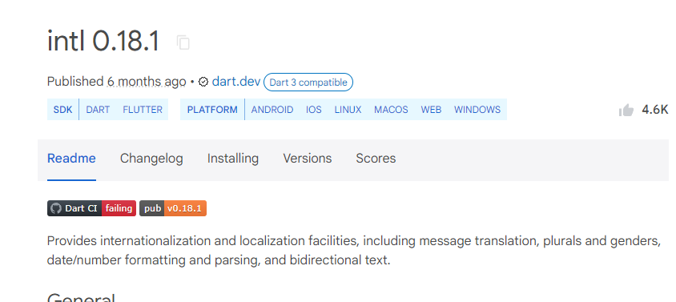
intl: ^0.18.1
flutter pub add intl

## Easy Localization
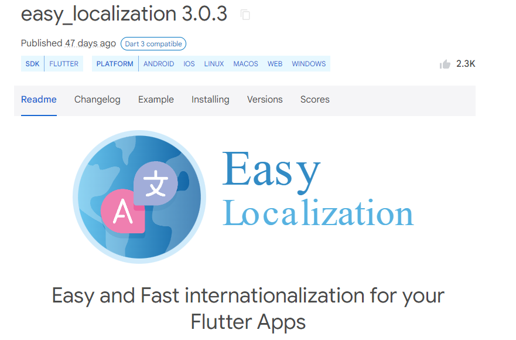
easy_localization: ^3.0.3
flutter pub add easy_localization

## Obter status da bateria
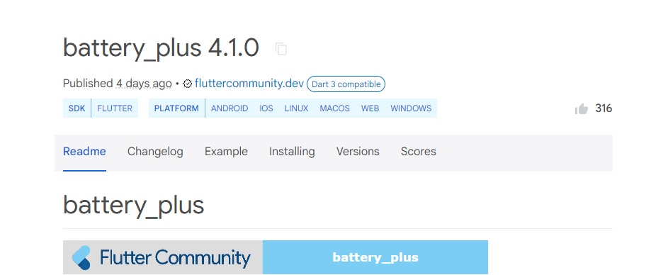
battery_plus: ^4.1.0
flutter pub add battery_plus

## Abrir URL externa

url_launcher: ^6.1.14

## Compartilhamento
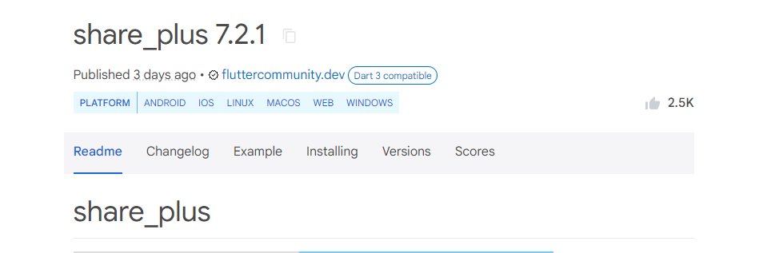
share_plus: ^7.2.1
flutter pub add share_plus

## Obtendo caminho das pastas do dispositivo
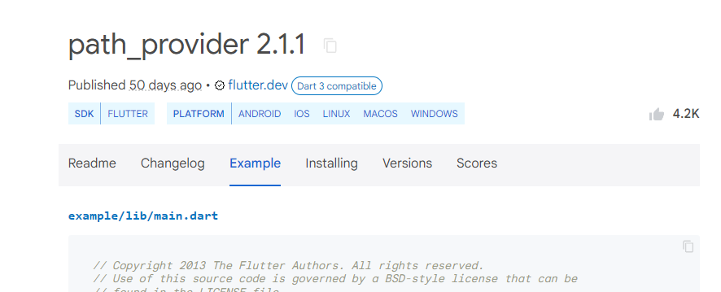
path_provider: ^2.1.1
flutter pub add path_provider

## Obtendo informações sobre o aplicativo
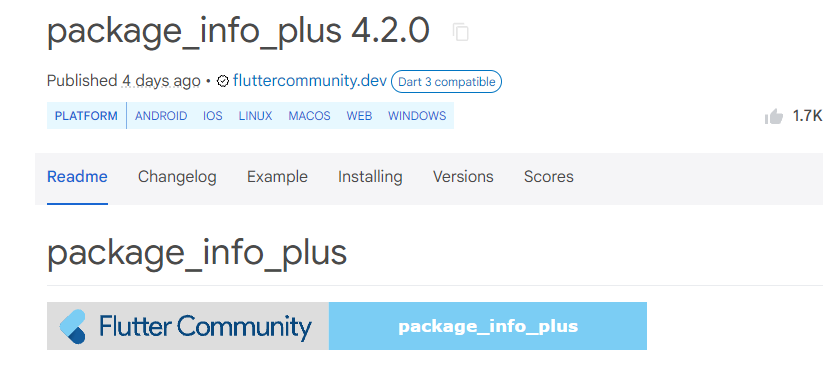
package_info_plus: ^4.2.0
flutter pub add package_info_plus

## obtendo informações do dispositivo
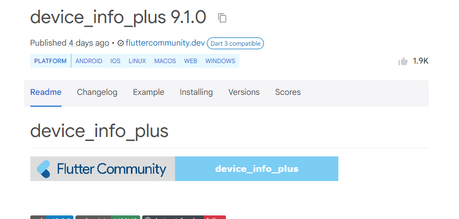
device_info_plus: ^9.1.0
flutter pub add device_info_plus

## Obtendo informacoes da conexao do dispositivo
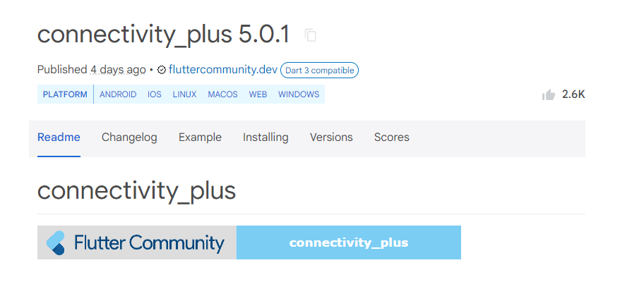
connectivity_plus: ^5.0.1
flutter pub add connectivity_plus

## obtendo informações do GPS
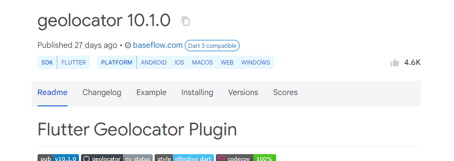
geolocator: ^10.1.0
flutter pub add geolocator